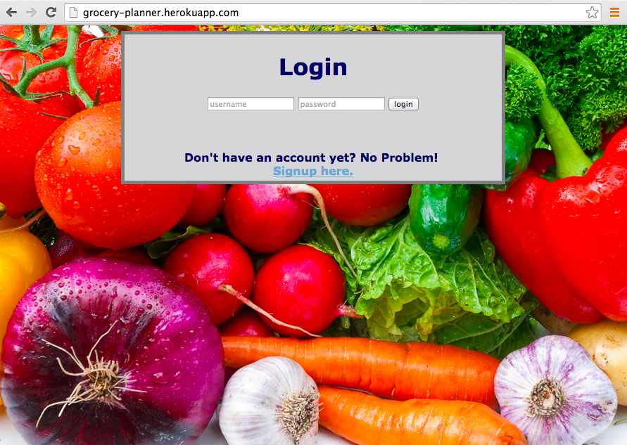
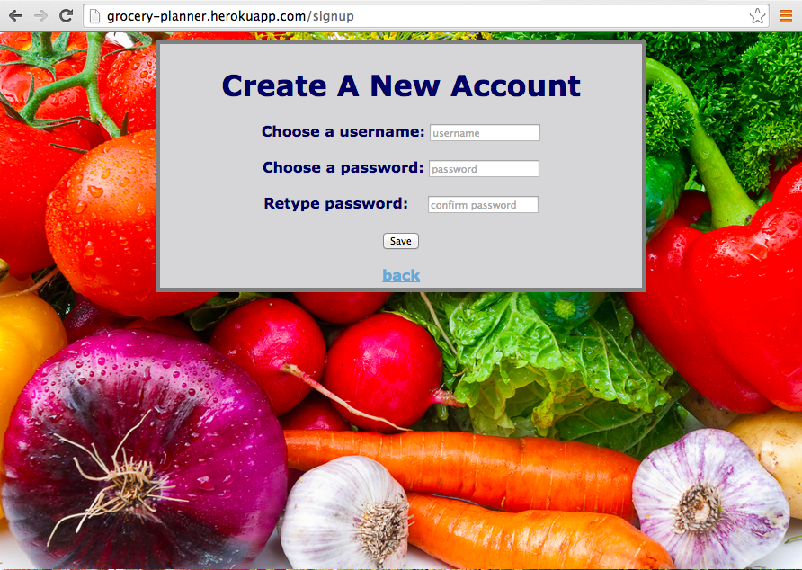
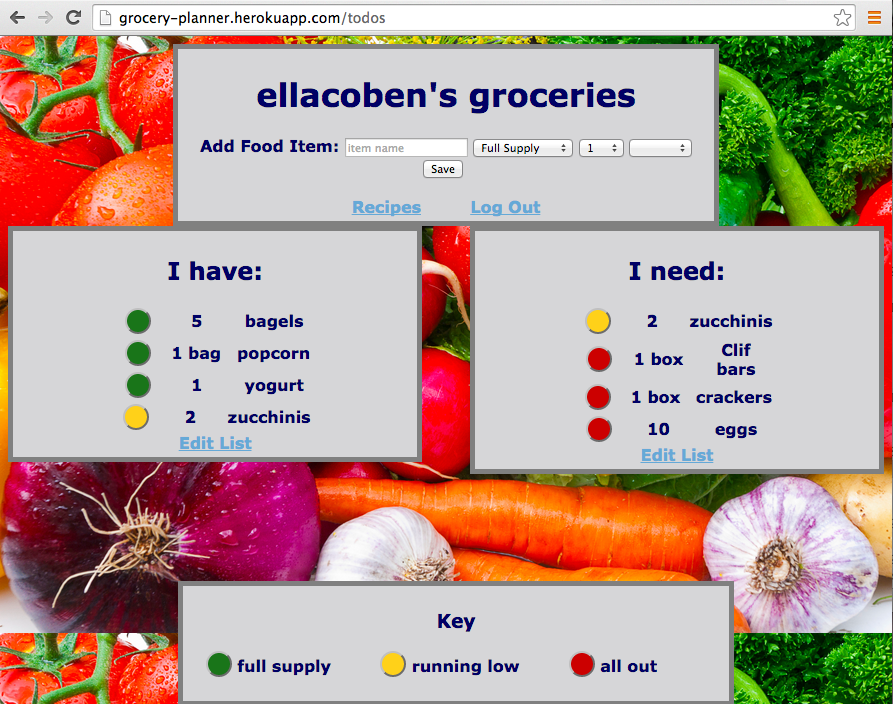
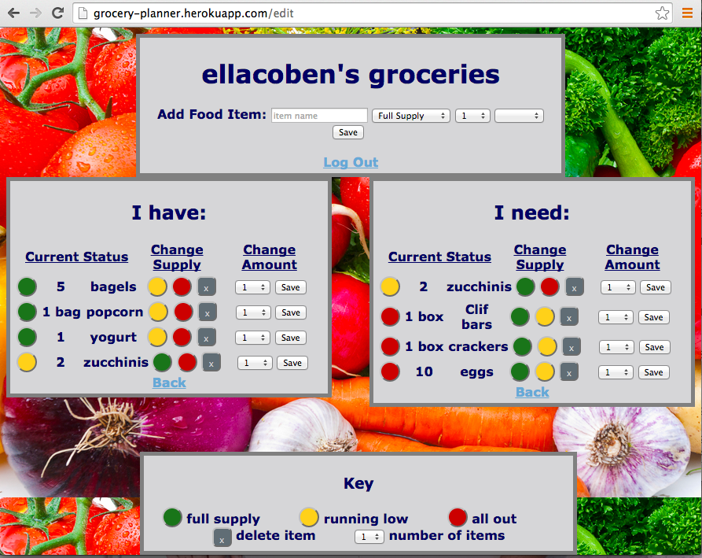
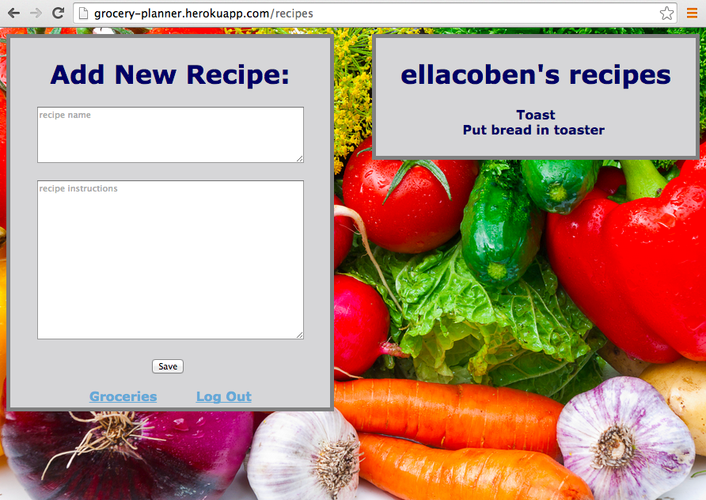
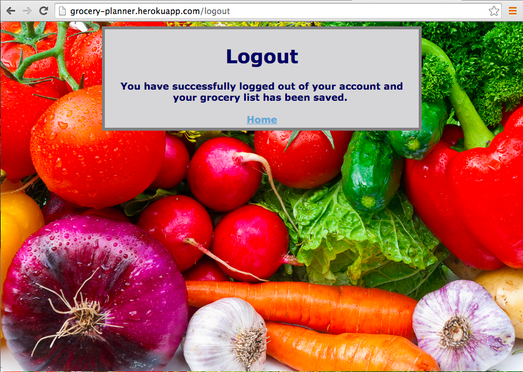

# Grocery Planner
## http://grocery-planner.herokuapp.com/
## How to use: 
The Grocery Planner is an interactive grocery list which keeps track of both what you already have and what you need to buy. It splits the items into two lists, under "I Have:" and "I Need:". This allows you to see what food you can make a meal out of and create a list of items you need to buy next time you go to the store. 

### Login and Signup Pages
The home page is the login seen below, with an option to create a new account.

### Grocery List Home Page
When you sign in, you see your current grocery list. You can enter an item to add to your grocery list, you can select the status of the food, the number of items, and the unit of the item. The status can be either 'Full Supply' (green circle, on the I Have list), 'Running Low' (yellow circle, both I Have and I Need lists), and 'All Out!' (red circle, on the I Need list).

### Grocery List Edit Page
You can edit the items by clicking the 'Edit List' option, which takes you to the editing page.

###Recipe List 
You can also add recipes to an account by clicking the 'Recipes' button, taking you to the Recipe List page. In the future, you'll be able to edit the recipe's ingredients as well, but that feature has not been implemented yet.

### Logout Page
Logging out ends the session and saves the current status of the lists.

## Code Structure:
The most important structural things to know is that there are four tables: 

1. users has a name and a password

2. groceries are called todo_items and have a description, a status(due_date), user id, number (of items) and unit.

3. recipes have a description, instructions, and a user id.

4. ingredients have a description, a recipe id, a number, and a unit.

The two lists are from the same table of information, separated by if-statements based on the item's current status.